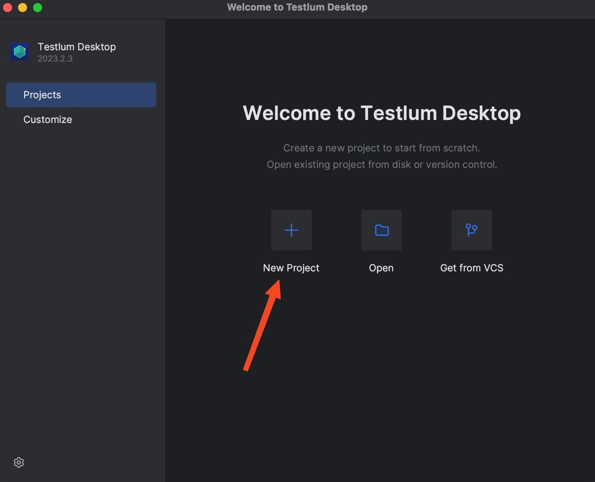
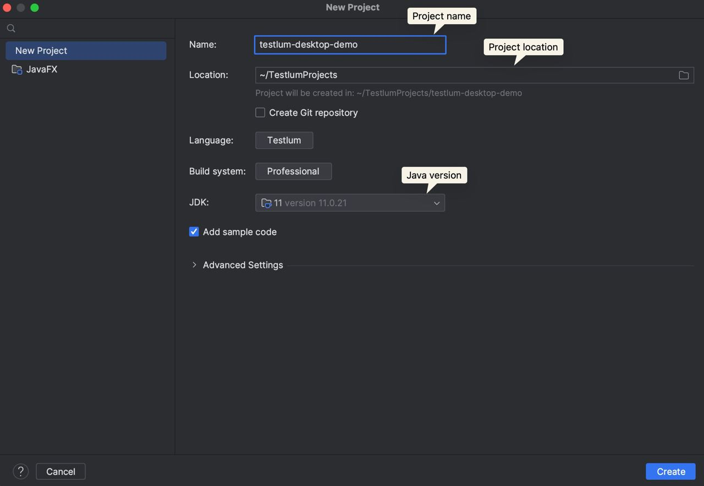
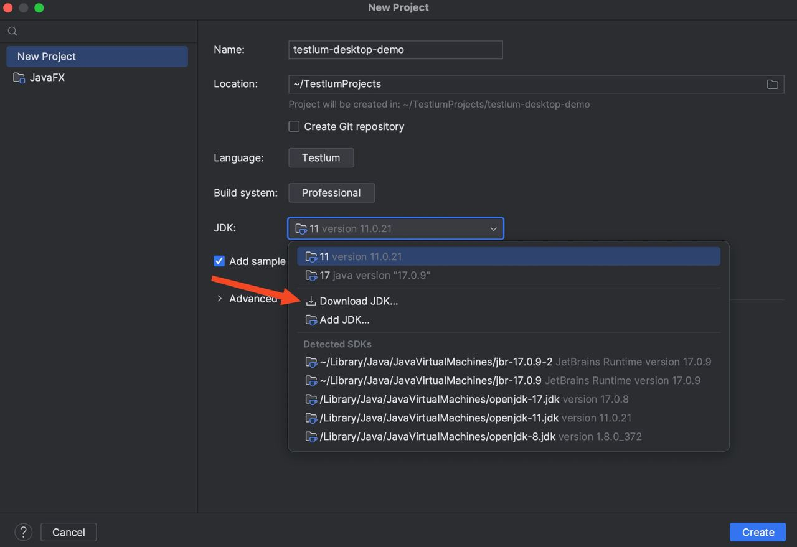
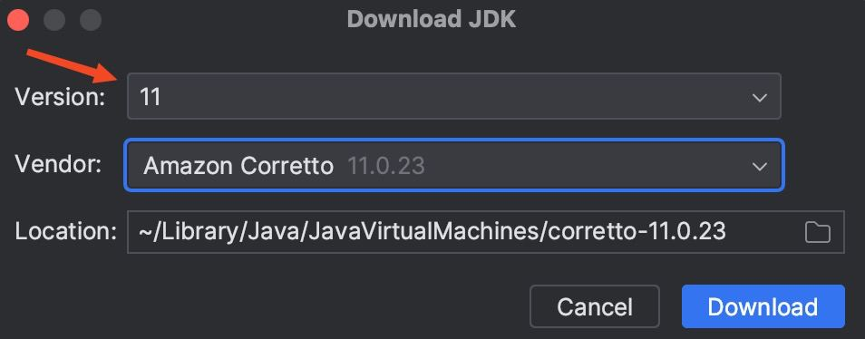
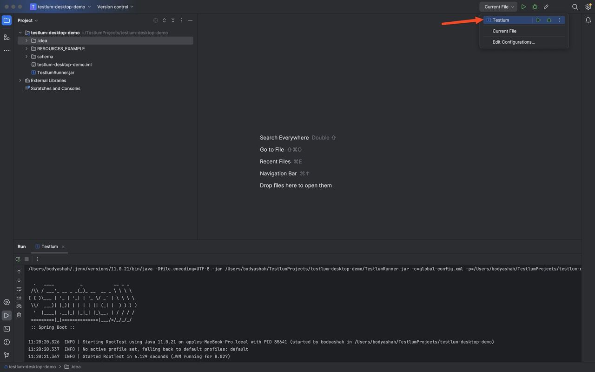
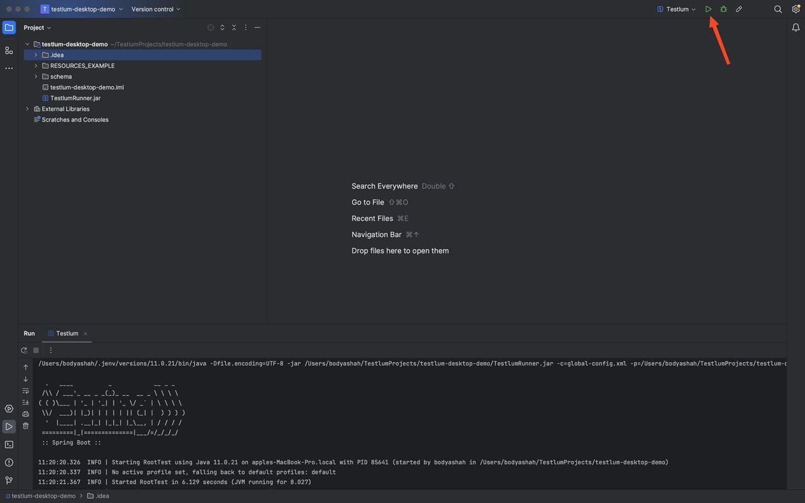

# How To Run Test Scenarios In Testlum IDE
**1. Create new project**

After successfully installing the Testlum IDE desktop application on your computer and opening it, you will see a welcome page where you can create a new project.

To create a new project, simply click on the 'New Project' button. This will bring up a window with the initial project settings.

**2. Project settings**

In this window you can specify a name for your project, the path on your computer where the new project will be created (by default all projects are created in <USER_FOLDER>/TestlumProjects/<PROJECT_NAME>).
You will also need to specify the Java version you want to use for future testing.

**3. Java installation**
If you have Java version 11 on your computer, you can skip this section. Otherwise you need to install version 11 directly from the Testlum IDE.
Simply click on the JDK box and select 'Download JDK...'.

Then select version 11 in the 'Version' field and click the 'Download' button.

Then simply click on `Create` button.

**4. How to run test scenarios**

To run the test scripts, all you need to do is select `Testlum` in the run configuration and click on the run button.

