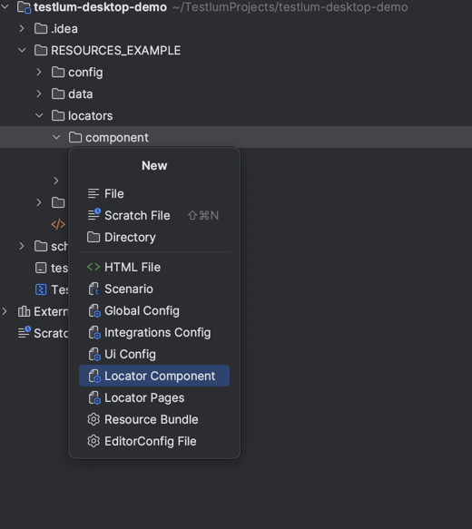

# Locators Components
> Before describing the WEB related commands, it is necessary to know how to create a locator and connect it to a scenario

## Available types of locators:

* id
* class
* xpath
* cssSelector
* text

**To create locators for LocatorId you need:**
  * `component` folder - contains files from page components that do not change according to the page (it can be a footer, a header). Also, for use, these locators must be included in the pages file required for use.
  * `pages` folder - contains files of different pages that change according to the link This approach is described in detail in the file [README_PAGES.md](README_PAGES.md)

To simplify creation of file with locators for components, You can use creation file from template. For this You need to:
1. right-click on `component` folder
2. choose `New` option
3. choose `Locator Component` option
4. specify locator file name and press `enter` (`header` for example)



After this You will see locator file with predefined structure:
```xml
<component xmlns:xsi="http://www.w3.org/2001/XMLSchema-instance"
           xmlns="http://www.knubisoft.com/testlum/testing/model/pages"
           xsi:schemaLocation="http://www.knubisoft.com/testlum/testing/model/pages component.xsd">>

  <locators>
    <locator locatorId="">
      <xpath></xpath>
    </locator>
  </locators>

</component>

```

* To give a unique name to the locator’s element, which must start with a lowercase letter (e.g:`email`)
```xml
<page xmlns="http://www.knubisoft.com/testlum/testing/model/pages">

    <locators>
        <locator locatorId="loginButton">   - a unique name of the locator
            <
        </locator>
    </locators>
      
</page>
```

* To set a type of the locator ( `id`, `xpath`, `class` etc )
```xml
<page xmlns="http://www.knubisoft.com/testlum/testing/model/pages">

    <locators>
        <locator locatorId="loginButton">   - a unique name of the locator
            <xpath></xpath>   - xpath type
        </locator>
    </locators>
  
</page>
```

* Place content in the selected locator type
```xml
<page xmlns="http://www.knubisoft.com/testlum/testing/model/pages">

  <locators>
    <locator locatorId="loginButton">   - a unique name of the locator
      <xpath>.//input[@type='login']</xpath>   - selected value of interaction
    </locator>
  </locators>

</page>
```

* An example of using a component locator file inside a page locator file:
```xml
<page xmlns="http://www.knubisoft.com/testlum/testing/model/pages">

    <details>
        <name>name_of_the_file_with_locators</name>
        <url>url_for_which_locators_are_written</url>
        <description>description_of_the_file_with_locators</description>
    </details>

    <include component="header.xml"/> - inclusion of all locators that are in the header.xml file in loginPages.xml, accordingly, the path to these files will begin with loginPages(an example of a file name from the pages folder)

    <locators>
        <locator locatorId="username">
            <id>LoginName</id>
        </locator>

        <locator locatorId="email"> 
            <xpath>//input[@type='email']</xpath> 
        </locator>
    </locators>

</page>
```

> Now you can use your locator - `loginPages.loginButton` for any command you need, and for any test

* An example of using locatorId in a command:
```xml
<click comment = "Click on 'Login' button" locator="loginPages.loginButton"/>  - path to desired element
```


