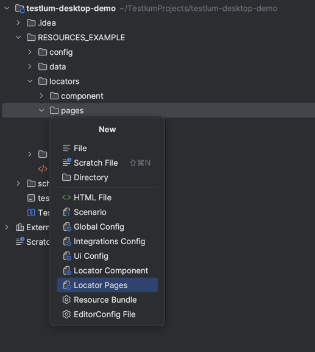

# Locators Page
> Before describing the WEB related commands, it is necessary to know how to create a locator and connect it to a scenario

## Available types of locators:

* id
* class
* xpath
* cssSelector
* text

**To create locators for LocatorId you need:**
* To create a file in the locators folder with the name of the page or component (e.g:`loginPages.xml`)
  * `component` folder - contains files from page components that do not change according to the page (it can be a footer, a header). Also, for use, these locators must be included in the pages file required for use. This approach is described in detail in the file [README_COMPONENTS.md](README_COMPONENTS.md)
  * `pages` folder - contains files of different pages that change according to the link

To simplify creation of file with locators for page, You can use creation file from template. For this You need to:
1. right-click on `pages` folder
2. choose `New` option
3. choose `Locator Pages` option
4. specify locator file name and press `enter` (`loginPages` for example)



After this You will see locator file with predefined structure:
```xml
<page xmlns:xsi="http://www.w3.org/2001/XMLSchema-instance"
      xmlns="http://www.knubisoft.com/testlum/testing/model/pages"
      xsi:schemaLocation="http://www.knubisoft.com/testlum/testing/model/pages pages.xsd">

    <details>
        <name></name>
        <url></url>
        <description></description>
    </details>

    <include component=""/>

    <locators>
        <locator locatorId="">
            <xpath></xpath>
        </locator>
    </locators>

</page>

```

* To give a unique name to the locator’s element, which must start with a lowercase letter (e.g:`email`)
```xml
<page xmlns="http://www.knubisoft.com/testlum/testing/model/pages">

    <locators>
        <locator locatorId="email">   - a unique name of the locator
            <
        </locator>
    </locators>
      
</page>
```

* To set a type of the locator ( `id`, `xpath`, `class` etc )
```xml
<page xmlns="http://www.knubisoft.com/testlum/testing/model/pages">

    <locators>
        <locator locatorId="email">   - a unique name of the locator
            <xpath></xpath>   - xpath type
        </locator>
    </locators>
  
</page>
```

* Place content in the selected locator type
```xml
<page xmlns="http://www.knubisoft.com/testlum/testing/model/pages">

  <locators>
    <locator locatorId="email">   - a unique name of the locator
      <xpath>.//input[@type='email']</xpath>   - selected value of interaction
    </locator>
  </locators>

</page>
```

> Now you can use your locator - `loginPages.email` for any command you need, and for any test

* An example of using locatorId in a command:
```xml
<click comment = "Click on 'email' button" locator="loginPages.email"/>  - path to desired element
```


