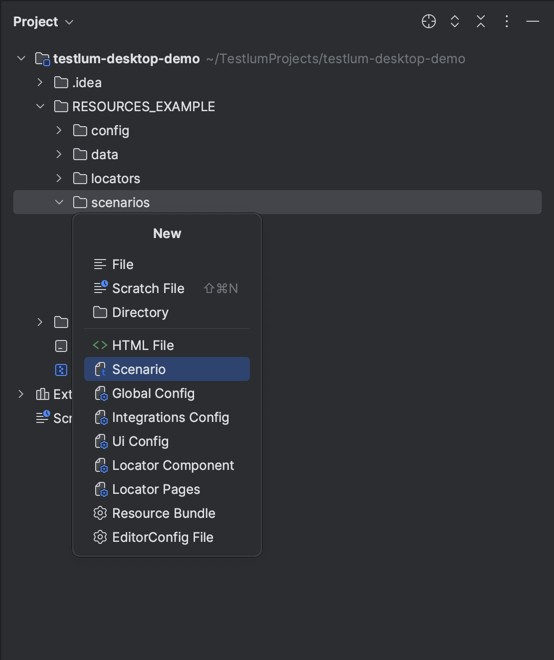

# Scenarios
> Scenarios - Folder for creating and storing test scenarios

## How To Create Test Scenario
To simplify creation of file with locators for page, You can use creation file from template. For this You need to:
1. right-click on `scnearios` folder
2. choose `New` option
3. choose `Scenario` option



After this You will see scenario file with predefined structure:
```xml
<scenario xmlns:xsi="http://www.w3.org/2001/XMLSchema-instance"
          xmlns="http://www.knubisoft.com/testlum/testing/model/scenario"
          xsi:schemaLocation="http://www.knubisoft.com/testlum/testing/model/scenario scenario.xsd">

    <overview>
        <description></description>
        <name></name>
    </overview>

    <settings>
        <tags></tags>
    </settings>


</scenario>
```

## Web Test Scenario Example
```xml
<scenario xmlns:xsi="http://www.w3.org/2001/XMLSchema-instance"
          xmlns="http://www.knubisoft.com/cott/testing/model/scenario"
          xsi:schemaLocation="http://www.knubisoft.com/cott/testing/model/scenario scenario.xsd">

    <overview>
        <description>Demonstration of the work of the 'click' tag</description>
        <name>Click</name>
    </overview>

    <settings>
        <tags>web</tags>
    </settings>

    <web comment="Start WEB scripts">

        <navigate command="to" comment="Go to base page"
                  path="/category/business"/>

        <wait comment="Wait for timeout scenario" time="2"/>

        <click comment="Click on 'Computer Book' tab"
               locatorId="click.computerBookClick"/>

        <wait comment="Wait for timeout scenario" time="1"/>

    </web>

</scenario>
```